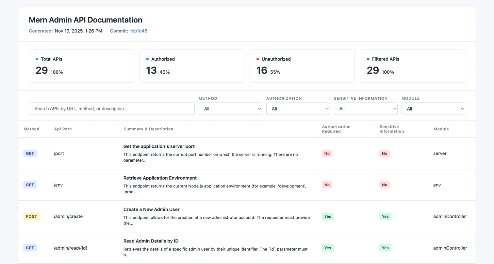

# ApiMesh: Code to OpenAPI Docs, Instantly

[](https://www.python.org/downloads/)
[](LICENSE)
[](https://github.com/qodex-ai/apimesh/actions/workflows/docker-build.yml)
[](#quick-start-30-seconds)
[](#quick-start-30-seconds)
[](https://discord.gg/MHDayrP7)
[](https://x.com/qodex_ai)

**Open-Source OpenAPI Generator** – Automatically scan your codebase, generate **accurate OpenAPI 3.0 specs**, and render a **beautiful interactive HTML API UI** for instant exploration.

**From code to live API docs in seconds** — no manual writing, no drift, no hassle.

---

## Overview

**ApiMesh** is the AI-powered open-source tool that:

- Scans your codebase automatically.
- Discovers all REST API endpoints, parameters, auth, and schemas.
- Generates a **valid `swagger.json` (OpenAPI 3.0)**.
- **Renders `apimesh-docs.html`** — a **fully interactive API UI** powered by Swagger UI.


> **Open the HTML file in any browser. No server. No setup. Just click and explore.**

---

### ✨ Key Features

| Feature | Benefit |
|-------|--------|
| 🔍 **Smart Code Discovery** | Finds endpoints across frameworks — no annotations needed |
| 📄 **OpenAPI 3.0 Spec** | `swagger.json` ready for CI/CD, gateways, and tools |
| 🌐 **Interactive HTML UI** | `apimesh-docs.html` — **instant API playground** with try-it-out |
| 🌍 **Multi-Language** | Python, Node.js, Ruby on Rails, Go, and more |
| ⚡ **Zero Config Start** | One command → full docs + UI |
| 📱 **Self-Contained HTML** | Share via email, GitHub, or CDN — works offline |

---

### 🧠 How It Works

A **precise, AI-augmented pipeline** ensures reliable, up-to-date docs:

1. **Scan Repo** → `FileScanner` walks your code (respects `.gitignore` + `config.yml`)
2. **Detect Framework** → Heuristics + LLM identify Express, FastAPI, Rails, etc.
3. **Harvest Endpoints** → Native parsers + LLM extract routes, methods, schemas
4. **Enrich Context** → Vector embeddings pull auth, models, examples per endpoint
5. **Generate Spec** → `swagger.json` built with OpenAI precision
6. **Render UI** → **`apimesh-docs.html`** embedded with **Swagger UI** — fully interactive
7. **Optional Sync** → Push to **Qodex.ai** for auto-tests and security scans

---

### 🌐 Supported Languages & Frameworks

| Language | Frameworks | Detection Method |
|--------|------------|------------------|
| **Python** | Django, Flask, FastAPI, DRF | Route files + decorators |
| **Node.js / TS** | Express, NestJS | `app.get`, `Router`, decorators |
| **Ruby on Rails** | Rails | `routes.rb` + controllers |
| **Go** | Gin, Echo, Fiber, Chi, Gorilla Mux, net/http | Tree-sitter router analysis |
| **Java, etc.** | Any REST | LLM fallback + patterns |

> Add custom patterns in `config.yml` — PRs welcome!

---

### 📂 Output Files

| File | Location | Purpose |
|------|----------|--------|
| `swagger.json` | `apimesh/swagger.json` | OpenAPI 3.0 spec |
| **`apimesh-docs.html`** | `apimesh/apimesh-docs.html` | **Interactive API UI** — open in browser |
| `config.json` | `apimesh/config.json` | Persisted CLI configuration (repo path, host, API keys) |
| `config.yml` | Repo root | Customize scan, host, ignores |

> **Deploy `apimesh-docs.html` to GitHub Pages, Netlify, or Vercel in 1 click.**

---

## Quick Start (30 Seconds)

### Option 1: docker (Recommended)

Navigate to your repository
```bash
cd /path/to/your/repo
```

Run interactively - will prompt for any missing inputs
```bash
docker run --pull always -it --rm -v $(pwd):/workspace qodexai/apimesh:latest
```

> The image runs as UID 1000. On Linux, if your repo is owned by a different user, add `--user "$(id -u):$(id -g)"` so the output files are writable and owned by you.

### Option 2: Using MCP

Download the MCP server file

```bash
curl -f https://raw.githubusercontent.com/qodex-ai/apimesh/main/swagger_mcp.py -o swagger_mcp.py
```

Add this to your MCP settings
```bash
{
  "mcpServers": {
    "apimesh": {
      "command": "uv",
      "args": ["run", "/path/to/swagger_mcp/swagger_mcp.py"]
    }
  }
}
```

Replace /path/to/swagger_mcp/swagger_mcp.py with the actual file path.


### Option 3: Curl

Navigate to your repository
```bash
cd /path/to/your/repo
```

Inside your repo root
```bash
mkdir -p apimesh && \
  curl -fsSL https://raw.githubusercontent.com/qodex-ai/apimesh/refs/heads/main/run.sh -o apimesh/run.sh && \
  chmod +x apimesh/run.sh && apimesh/run.sh
```

> Each run leaves `swagger.json`, `apimesh-docs.html`, `run.sh`, and `config.json` side-by-side inside the `apimesh/` workspace folder.

### Swagger-only runs (no HTML viewer)

Pass `--no-html` to the docker image or to `run.sh` to write `swagger.json` and skip `apimesh-docs.html`. The same thing happens if you set `APIMESH_SKIP_HTML=1` in the environment, which is handy for CI and agent runs.

---

## 🤝 Contributing

Contributions are welcome!

Open an issue for bugs, feature requests, or improvements.

Submit PRs to enhance language/framework coverage.

Help us make API documentation automatic and effortless 🚀
